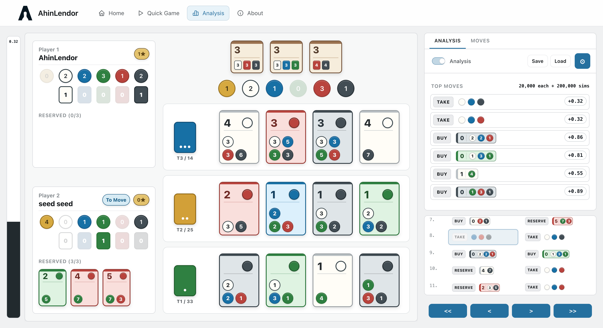
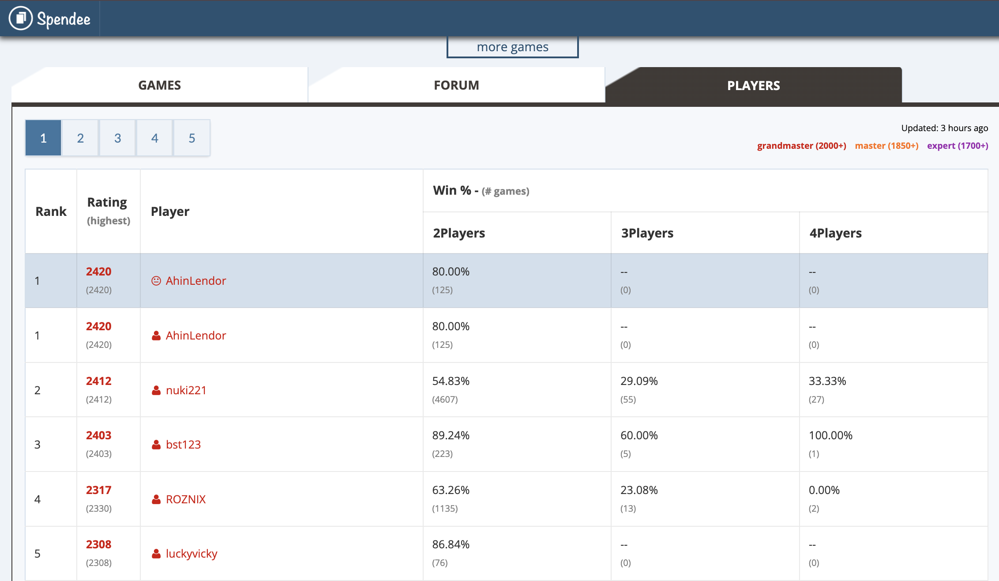
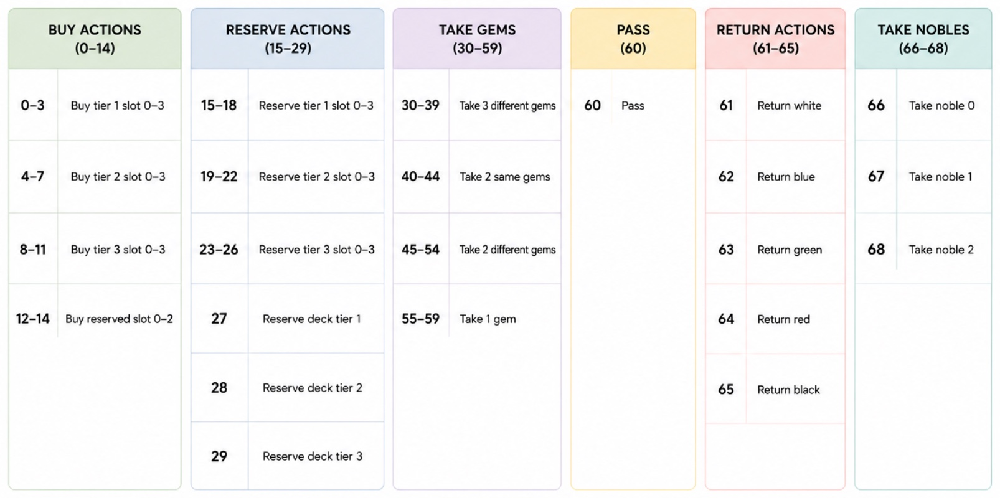
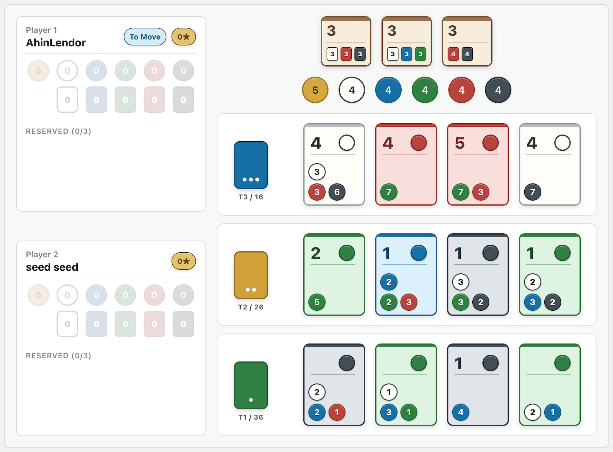
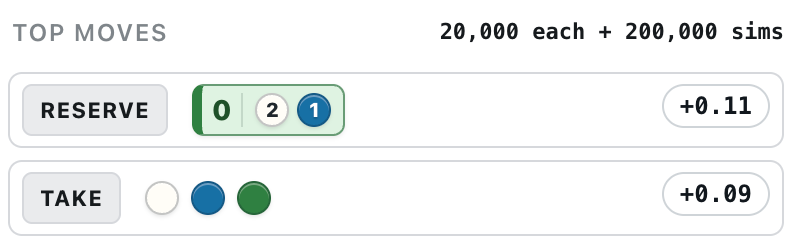

# AhinLendor




An **AlphaZero-style AI for Splendor**, trained entirely through self-play.

AhinLendor combines a native C++ game engine, a PyTorch policy-value network, and Monte Carlo Tree Search (MCTS) to learn the game without human data. It reached **Rank 1 on Spendee** and serves as the research engine behind the AhinLendor web application.




# AlphaZero Architecture

AhinLendor follows the standard AlphaZero training loop:

```
Self Play
      ↓
 Monte Carlo Tree Search
      ↓
Policy-Value Network
      ↓
 Training
      ↓
Stronger Model
      ↺
```

The neural network predicts both:

- **Policy** — probability distribution over legal moves
- **Value** — estimated probability of winning

During play, these predictions guide MCTS to produce stronger search than the network alone.


# Engine Specifications

When AhinLendor first reached Rank 1 on Spendee, it competed under a **5 minutes + 10 seconds per action** time control, performing approximately **70,000 MCTS simulations** per move.

Later versions significantly improved search by combining:

- **250,000 MCTS simulations**
- **20,000 Bootstrap iterations**
- **Batch inference of 64 leaf evaluations**

Running on a **MacBook M2**, this version typically spent around **20 seconds per move**.

# Key Design Decisions

### 1. Reduced Action Space


One of the first design challenges was defining the policy action space.

Splendor naturally contains many combinations of gem collections, token returns, and card interactions. Treating every possibility as a separate action quickly becomes impractical. For comparison, Jonatan Simonsson's master's thesis *Creating an AI Opponent with Super-Human Performance for Splendor* uses **371 actions**.

AhinLendor reduces the action space to only **69 actions** by:

- returning gems one token at a time in a dedicated return phase;
- limiting buy and reserve actions to cards currently visible on the board;
- sharing fixed action slots across equivalent board positions.

This preserves the complete game rules while making policy learning substantially easier.

<p align="center">
  
</p>


---

### 2. Bootstrap MCTS

While analyzing games against former Board Game Arena Rank 1 player **seed seed**, an interesting weakness emerged.

In one position, AhinLendor chose to collect gems. However, the strongest move was to reserve an inexpensive green development card, unlocking an efficient path toward several powerful Tier 3 purchases.

<p align="center">
  
  <br>
  <em>AhinLendor vs seed seed, AhinLendor to move.</em>
</p>

<p align="center">
  
  <br>
  <em>AhinLendor thinks taking gems is better than reserving the crucial tier-1 card.</em>
</p>

The problem was not the search algorithm itself, but the interaction between the neural network and MCTS.

Because MCTS naturally spends most of its simulations on moves that already appear promising, actions receiving poor initial evaluations from the neural network may receive very little exploration—even when deeper search would reveal them to be the strongest moves.

To address this, I developed **Bootstrap MCTS**.

Before standard MCTS begins, the search first performs a fixed number of simulations from **every legal move one ply ahead**. Only after this initial exploration does normal MCTS allocate simulations according to its search policy.

This allows underestimated moves to demonstrate their strength before search becomes selective.

After introducing Bootstrap MCTS, the engine correctly identified reserving the green card as the best move.

<p align="center">
  
  <br>
  <em>With bootstrap search (20K each), AhinLendor now correctly evaluates that reserving the tier-1 card is the best move.</em>
</p>

# Tech Stack

| Component | Technology |
|-----------|------------|
| Engine | C++17 + pybind11|
| Search | MCTS |
| Neural Network | PyTorch |
| Backend | FastAPI |
| Frontend | React + TypeScript + Vite |
| Build | CMake |
| Live Play | Playwright |


# License

MIT License
